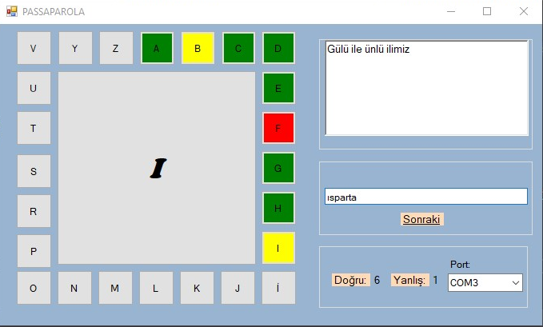
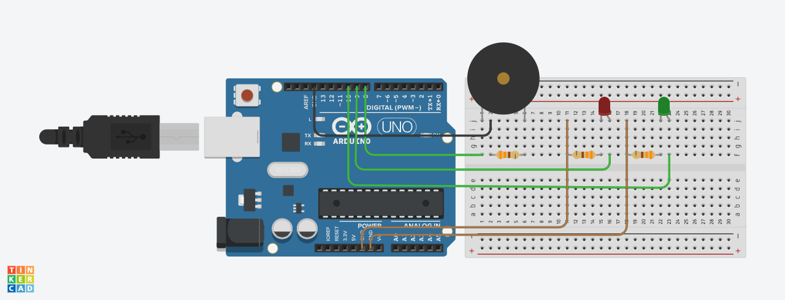
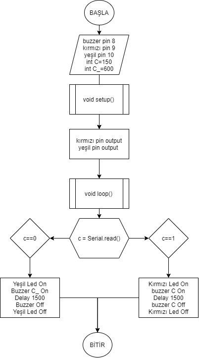

# Arduino ile Passaparola Yarışması
Geçtiğimiz yıllarda sevilerek izlenen ve Metin Uca'nın sunumuyla özdeşleşmiş olan bir bilgi yarışması TV programı olan Passaparola, C# programlama dili ve arduino uno mikrodenetleyici kartı ile birlikte kullanılarak modellenmiştir. Bu proje Mikroişlemciler dersi için geliştirilmiştir.
Uygulama tanıtım videosuna [buradan](https://www.youtube.com/watch?v=nU3hGvrmQC4) ulaşabilirsiniz.

---
## C# Haberleşmesi ile LED Yakma
Tasarlanan bu proje ile, C# programlama dili kullanılarak geliştirilen Passaparola adlı, kullanıcıya yöneltilen genel kültür sorularının doğru ya da yalış cevaplandırılmasına göre ilerleyen bir program aracılığıyla Arduino UNO mikrodenetleyicisi üzerinden elektronik veriler ile fiziksel ortamda çıktılar alınması amaçlanmaktadır. Kullanıcı, kendisine yönlendirilen soruya doğru cevap verirse doğru cevap verildiğini temsil eden yeşil led ve ses ile, yanlış cevap vermesi halinde kırmızı led ile ses çıkışının alınması sağlanmıştır. Projede elektronik çıktılar almak için bir adet Arduino UNO R3 mikrodenetleyici kart, kırmızı ve yeşil olmak üzere iki adet LED, bir adet buzzer, 3 adet 330 ohm direnç, 6 adet jumper kablo ve bir adet breadboard kullanılmıştır.

> Uygulama Ekranı:
> 
>> 

Arduino UNO R3 mikrodenetleyici kart üzerinde 8 bitlik ATmega328 mikrodenetleyici bulunmaktadır. ATmega328, 32 kb (önyükleyici için kullanılan 0,5 kb) Flash belleğe sahiptir ve 2 kb SRAM ile 1 kb EEPROM’ a sahiptir. Üzerindeki 14 dijital pin pinMode(), digitalWrite() ve digitalRead() fonksiyonları kullanılarak giriş ve çıkış birimleri olarak kullanılabilir. 6 adet analog girişe sahip olmakla birlikte 5V’ ta çalışırlar ve her pin maksimum 40 mA sağlayabilir ya da alabilir. 

Arduino Uno, Arduino IDE’ si kullanılarak programlanabilir. ATmega328, harici bir donanım programcısı kullanmadan yeni kod yüklemenize izin veren bir önyükleyici ile önceden yüklenmiş olarak gelir. Atmel AVR Flash mikrodenetleyicileri için bir başlangıç kiti ve geliştirme sistemi olan STK500 protokolünü kullanarak iletişim kurar.
Bu projede Arduino mikrodenetleyici kartı programlamak için Arduino programlama dili kullanılacaktır. Arduino programlama dili, temelde C/C++/Java tabanlı IDE, açık kaynak kodlu ve platform bağımsızdır.

> Devre Çizimi:
> 
>> 

Projede mikrodenetleyici kartı, buzzer, led ve dirençlerin bir araya getirilerek fiziksel çıktılar elde edilmesini sağlayan devrenin Tinkercad kullanılarak elde edilen çizimi yukarıdaki şekil ile gösterilmiştir.

> Yazılım Akış Şeması:
> 
>> 

Projenin Arduino ile programlama adımında kullanılan yazılım akış şeması yukarıdaki şekil ile gösterilmiştir.

## Program Kodları ve Çalışma Mantığı
```
#define buzzerPin 8
#define kLed 9`
#define yLed 10
int C = 150;
int C_ = 600;
void setup()
{
    pinMode(yLed,OUTPUT);
    pinMode(kLed,OUTPUT);
    Serial.begin(9600);     
}
void loop()
{
  if(Serial.available())
  {
    char c = Serial.read();
    if(c=='1')
    {
      digitalWrite(yLed,HIGH);
      Serial.println("Doğru Cevap!");
      tone(buzzerPin, C_);
      delay(1500);
      noTone(buzzerPin);
      digitalWrite(yLed,LOW);    
    }
    else if(c == '0')
    {
      digitalWrite(kLed,HIGH);
      Serial.println("Yanlış Cevap!");
      tone(buzzerPin, C);
      delay(1500);
      noTone(buzzerPin);
      digitalWrite(kLed,LOW);
    }
  }
}
```
Mikrodenetleyiciye yüklenecek olan program kodlarına ilk olarak buzzer ile kırmızı ve yeşil ledlerin kart üzerinde tetiklenecekleri pin kodlarının tanımlanması ile başlanmıştır. Ayrıca buzzerın çıkaracağı iki farklı ses frekansının da C ve C_ adlı değişkenlere atanması da bu kısımda gerçekleştirilmiştir.
Ardından led pinleri, motorlar, sensörler, kesmeler vb. kurulumların gerçekleştirildiği void setup() fonksiyonu içerisinde, programın başında tanımlanan kLed ve yLed değişkenlerinin içerdiği pin kodlarının birer çıkış birimi olduğu bilgisi geçilmiştir. Ayrıca seri bağlantı noktasının  veri hızın 9600 bps'ye ayarlanarak açılması işlemi gerçekleştirilmiştir.
Sensörlerden bilgi alınması, motorların kontrol edilmesi ve ledi yak/söndür gibi ana işlemlerin gerçekleştirildiği void loop() fonksiyonu içerisinde öncelikle seri bağlantının kullanılabilir olup olmadığının kontrol edilmesi ile başlanmıştır. Eğer kullanılabilir durumda ise seri porttan gelen değer char veri türünde ve c adında bir değişkene atanmıştır. 
Bu işlemin devamında ledlerden hangisinin yanacağı ve buzzerın hangi sesi çıkaracağı denetimi c değişkenine gelen 1 ve 0 rakamlarına göre if şart bloklarının içerisinde tanımlanmıştır. Eğer c değeri 1 olursa kullanıcının kendisine yöneltilen soruya doğru cevap verdiği anlaşılacak olup yLed ve buzzerPin değişkenlerine tanımlanan pinler tetiklenip yeşil ledin yanması ve buzzerın C_ değişkenine tanımlanan hrz değerinde ses çıkarması tanımlanmıştır. c değişkenine gelen değerin 0 olması durumunda kullanıcının kendisine yöneltilen soruya yanlış cevap verdiği değerlendirilecek olup kLed ve buzzerPin değişkenlerine tanımlanan pinler tetiklenip kırmızı ledin yanması ve buzzerın C değişkenine tanımlanan Hz değerinde ses çıkarması tanımlanmıştır. Yine bu bölümde ledlerin yanma ve sönme süresi ile buzzerın ses süresi aralığı 1500 ms olarak tanımlanmıştır.
Proje, tasarlanan devrenin ve yazılan programın Arduino Uno mikrodenetleyici kartına doğru şekilde yüklenmesinin ardından C# programlama dilinde yazılan Passaparola isimli program ile uyumlu şekilde çalışabilmesi için System.IO.Ports kütüphanesi import edilerek mikrodenetleyicinin bağlı bulunduğu portun aktifleştirilmesi ile veri alışverişinin sağlanması gerçekleştirilmiştir.
